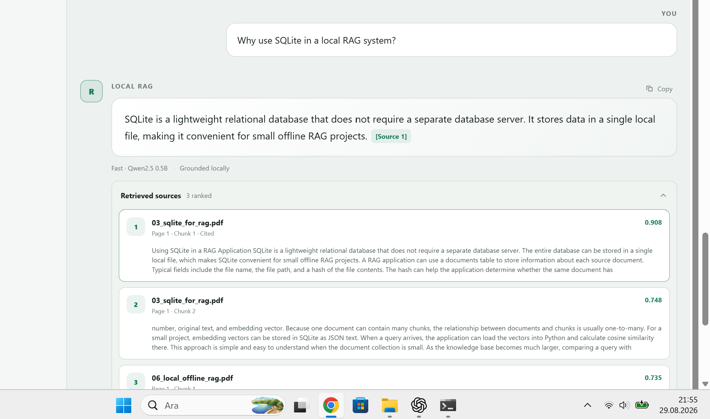
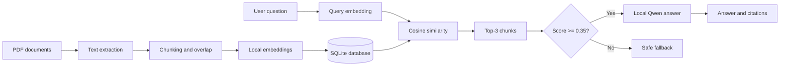

# Local RAG Assistant with Microsoft Foundry Local

A fully local and offline Retrieval-Augmented Generation (RAG) assistant built
with Python, SQLite, Qwen models, and Microsoft Foundry Local. The application
answers questions only from the indexed PDF collection and shows the supporting
source passages.



## Highlights

- Fully local document processing, retrieval, and answer generation
- Offline web interface available only on `localhost`
- PDF text extraction, chunking, and embedding generation
- SQLite storage for documents, chunks, and embedding vectors
- Cosine-similarity retrieval with Top-3 results
- `0.35` minimum retrieval-similarity threshold
- Source-grounded answers with page-level citations
- Safe fallback when the documents do not support an answer
- Fast and Quality answer modes
- Light and dark interface themes

## Models

| Purpose | Model | Interface mode |
| --- | --- | --- |
| Embeddings | `qwen3-embedding-0.6b` | Always active |
| Faster answers | `qwen2.5-0.5b` | Fast |
| Higher-quality answers | `qwen3-4b` | Quality |

The models are downloaded separately and are not stored in this repository.

## Architecture



## Evaluation

| Metric | Result |
| --- | ---: |
| Test documents | 6 |
| Indexed chunks | 16 |
| Retrieval Top-1 accuracy | 91.7% |
| Retrieval Top-3 accuracy | 100% |
| Answerable questions passed | 12/12 |
| Fallback questions passed | 3/3 |
| End-to-end evaluation | 15/15 |

These results apply to the included educational test collection.

## Example behavior

Question supported by the documents:

```text
Why use SQLite in a local RAG system?
```

The assistant returns a concise answer with a citation such as `[Source 1]` and
shows the retrieved file, page, chunk, and similarity score.

Question outside the documents:

```text
What is a pizza?
```

If the best similarity score is below `0.35`, the application returns:

```text
The information is not available in the provided sources.
```

## Requirements

- Windows 10 or Windows 11
- Python 3.12
- Microsoft Foundry Local
- The three models listed above

Install the Python dependencies from the `project` folder:

```powershell
python -m venv .venv
.\.venv\Scripts\Activate.ps1
pip install -r requirements.txt
```

Download the local models:

```powershell
foundry model download qwen3-embedding-0.6b
foundry model download qwen2.5-0.5b
foundry model download qwen3-4b
```

## Run the application

After installing the requirements and models, double-click:

```text
Start_Local_RAG_Web.bat
```

The application opens at:

```text
http://localhost:8765
```

Keep the terminal window open while using the application. Press `Ctrl+C` in
that window to stop the local server.

## Rebuild the knowledge base

Place PDF files in the `documents` folder, activate the Python environment, and
run this command from the `project` folder:

```powershell
python multi_pdf_ingest.py
```

## Project structure

```text
LocalRAG_Final/
|-- documents/                  Sample PDFs and SQLite knowledge base
|-- project/
|   |-- web/                    Offline HTML, CSS, and JavaScript interface
|   |-- web_app.py              Local web server and RAG API
|   |-- multi_pdf_ingest.py     PDF ingestion and embedding pipeline
|   |-- multi_pdf_rag.py        Command-line RAG assistant
|   |-- evaluate_retrieval.py   Retrieval evaluation
|   |-- evaluate_rag.py         End-to-end evaluation
|   |-- performance_test.py     Local performance measurements
|   |-- requirements.txt        Python dependencies
|   `-- README.md               Detailed technical documentation
|-- Start_Local_RAG_Web.bat     Windows launcher
`-- README.md                   GitHub project overview
```

## Privacy

PDF processing, embeddings, retrieval, and language-model inference run on the
local computer. No cloud API is required during normal use.

## Limitations

- The evaluation collection is intentionally small and educational.
- Quality mode requires more local memory and processing than Fast mode.
- Answers are limited to information available in the indexed documents.
- Model files must be downloaded separately on each computer.

## License

This project is available under the MIT License. See [LICENSE](LICENSE).
